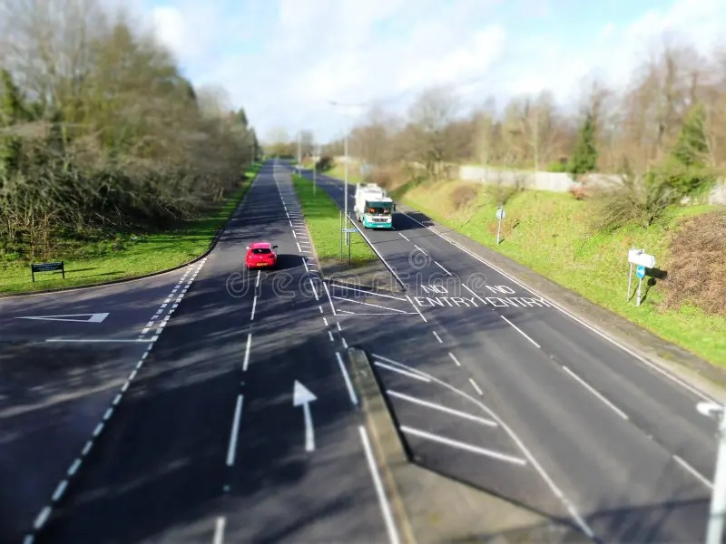

# Distances

- Closest you can park to a junction: `10 meters`
- How far to place a visibility triangle for a broken down car: `45 meters`
- When to turn lights on for poor visibility: `100 meters`

# Dual Carrigeway Central Reservation

- The dual carrigeway centeral reservation is the area seperating the traffic flowing in different directions. This may sometimes be tarmac. In this situation, it is allowed to cross the traffic going north and go onto the lanes of traffic going south. If the centeral reservation isn't long enough to stop in there, you must wait until it is clear in both directions before crossing.

