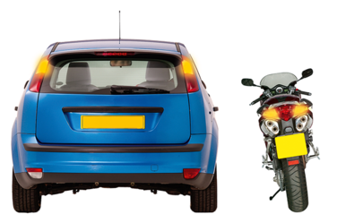
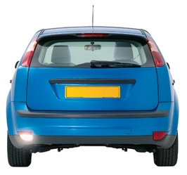
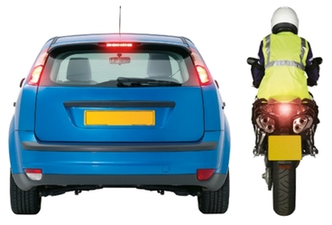
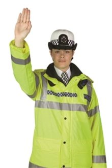
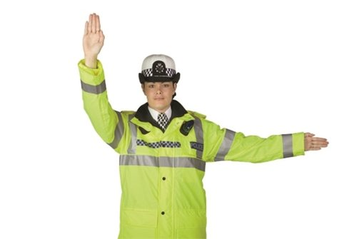
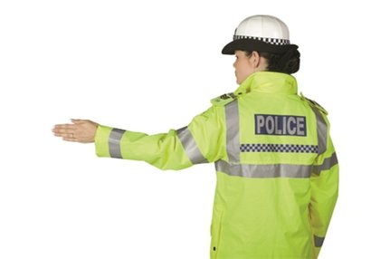
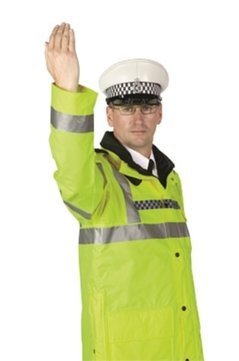
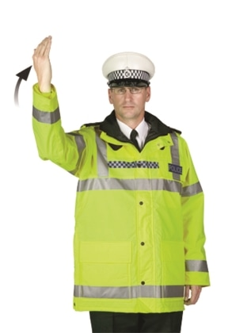
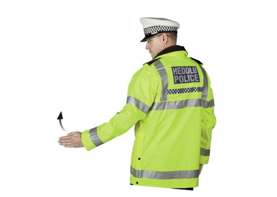

# Rules of the Road - Driving Theory Notes

### 1. Speed Limits
- **Built-up areas**: 30 mph (unless signs show otherwise)
- **Single carriageways**: 60 mph (a road with one lane in each direction, no physical central barrier)
- **Dual carriageways**: 70 mph (a road with a central reservation/barrier separating traffic flowing in opposite directions)
- **Motorways**: 70 mph

### 2. Road Junctions
- **Unmarked junctions**: No one has priority - proceed with caution
- **Turning right**: Give way to oncoming traffic
- **Emerging**: Give way to traffic on major road
- **T-junctions**: Traffic on major road has priority

### 3. Roundabouts
- **Approach**: Slow down and choose correct lane
- **Give way** to traffic from your right already on roundabout
- **First exit (left)**: Signal left on approach, stay in left lane
- **Straight ahead**: No signal on approach, use left or middle lane, signal left after passing exit before yours
- **Right/last exit**: Signal right on approach, use right lane, signal left after passing exit before yours

### 4. Traffic Lights
- **Red**: Stop at stop line
- **Red and Amber**: Prepare to go but don't move off
- **Green**: Go if way is clear
- **Amber**: Stop unless you've already crossed stop line

### 5. Level Crossings
- **Stop** when red lights flash
- **Never queue** across the crossing
- **If barriers stay down**, wait - don't drive around them
- **If you break down** on crossing, get everyone out immediately

### 6. Pedestrian Crossings
- **Zebra crossings**: Must stop if someone is waiting to cross
- **Pelican crossings**: Traffic light controlled, has flashing amber phase after red
- **Puffin crossings**: Traffic light controlled, no flashing amber phase
- **Toucan crossings**: Both cyclists and pedestrians can cross together

### 7. Parking Rules
- **Don't park** where you would obstruct emergency vehicles
- **Don't park** within 10 metres of a junction
- **Don't park** on pedestrian crossings or zig-zag lines
- **Don't park** opposite a traffic island

### 8. One-way Streets
- **Travel only** in direction indicated by signs
- **Park on left or right** unless signs or road markings say otherwise
- **May pass** on either side in a one-way street

### 9. Bus and Cycle Lanes
- **Blue rectangular signs** show times of operation
- **White road markings** show lane boundaries
- **Don't drive** in them during operational hours
- **Never park** in bus or cycle lanes

### 10. Road Markings
- **Double white lines**: 
  - Solid line nearest you = do not cross/overtake
  - Broken line nearest you = may cross if safe
- **Stop line** (thick solid line): Must stop completely
- **Give way line** (broken triangles): Give way to traffic on major road
- **Box junctions** (yellow criss-cross): Don't enter unless your exit is clear
- **Zig-zag lines**: No stopping, no overtaking

### 11. Traffic Officers
- **Must obey** signals from traffic officers
- **Have powers** to stop vehicles
- **Wear uniform** with yellow and black jackets

## Types Of Roads

### Single Carriageway Road 
A road in which traffic from both sides share the same stretch of pavement, without a pavement, such as Manchester Road

### Dual Carriageway Road 
A road in which traffic from opposite directions is separated by something in the middle, such as a barrier. For example, a motorway

## Lights

If I need to use lights, it is always dipped headlights.

The question/ answer may call it headlights instead of dipped headlights.

If the answer is something other than dipped headlights, there will be a clue in the question, such as parking

It is only allowed to flash your headlights to warn other drivers of your presence. It is not allowed to flash your headlights for any other reason

### Hazard Lights

### Reverse Lights

### Brake Lights

## Police

### Police Hand Signals

Police officers may use hand signals to control traffic when traffic lights are not working or in special situations:

#### Stop Traffic Approaching from the Front
The officer raises one hand with the palm facing the traffic, signaling vehicles to stop.

#### Stop Traffic Approaching from Both Front and Behind
The officer raises both hands with palms facing the traffic from both directions, indicating that vehicles from both sides should stop.

#### Stop Traffic Approaching from Behind
The officer raises one hand with the palm facing the traffic coming from behind, signaling those vehicles to stop.

#### Beckon Traffic On from the Side
The officer uses a waving motion with the arm to signal vehicles to proceed.

#### Beckon Traffic On from the Front
The officer uses a waving motion with the arm to signal vehicles to proceed from the front.

#### Beckon Traffic On from Behind
The officer uses a waving motion with the arm to signal vehicles to proceed from behind.

### Police Signalling You to Stop

When a police vehicle wants you to pull over:

#### Recognizing the Signal
- Flashing blue lights, headlights, or flashing headlights
- Sometimes accompanied by sirens
- Police officer may point or gesture for you to pull over

### Safe Procedure
1. **Acknowledge** - Turn on your left indicator to show you've seen them
2. **Find safe place** - Pull over when and where it's safe to do so
3. **Stop** - Apply the handbrake and turn off your engine
4. **Wait** - Remain in your vehicle unless instructed otherwise
5. **Cooperate** - Follow instructions and be polite

### What to Expect
- Officer will explain why you were stopped
- You may be asked for your driving license, insurance, and MOT certificate
- You may receive advice, a warning, or a fixed penalty notice
