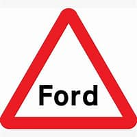
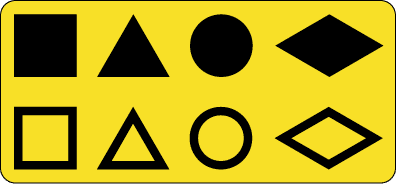
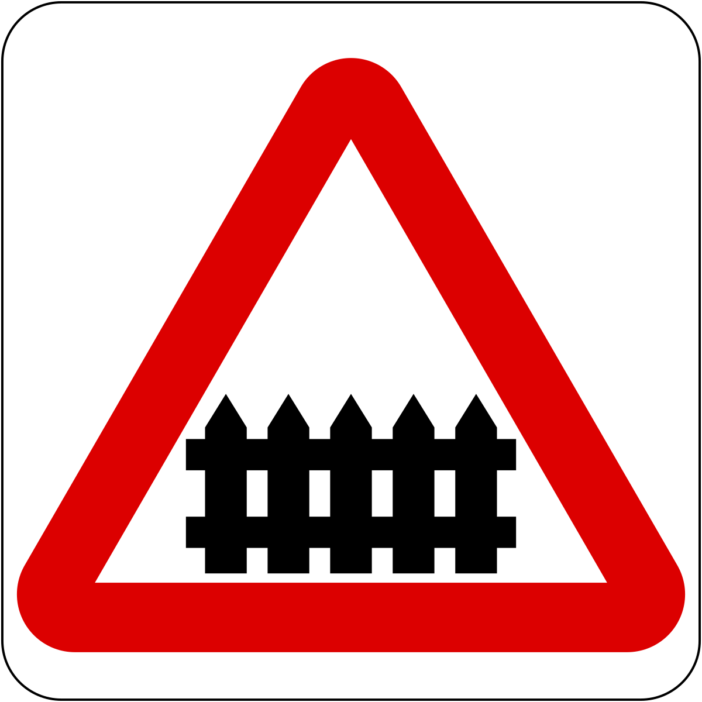

# Questions About Road Signs

95% off red circles are "NOs"

Blue Circles mean do it this way/ mandatory

Triangles are warnings. It means you need to check your mirrors

Squares are information

With Flow means traffic is going with the flow. Contraflow means traffic is going against the flow

Yellow background, black image means diversion

Level Crossing means a train is crossing

### Triangle Signs
- Right Way White Triangle With Red Border = **Warnings**
- Upside Down White Triangle With Red Border = **Give Way**

## Waiting Restrictions

## With Flow Bus And Cycle Lane

## Contraflow Bus Lane

## Water coming up ahead

## Carry On And Leave The Mortorway At The Next Exit

## Diversion

## Temporary Maximum Speed

## Park And Ride Car Park

## Crawler Lane For Heavy And Slow Viechles

## Level Crossing With Gate Or Barrier

## Viechles May Park Fully On The Verge Or Fotway

## No Motor Viechles

# Questions About Signs On The Road

## Get Back To The Left As Soon As It's Safe To Do So

# Questions About Arm Signals

## Turn Left Arm Signal

## Turn Right Arm Signal

## Slow Down Or Stop Arm Signal

# Questions About Lights

## Hazard Lights

## Reverse Lights

## Brake Lights

