# Questions About Road Signs

**Red Circles** = Prohibition (What you MUST NOT do)

**Blue Circles** = Mandatory (What you MUST do)

**Triangles** = Warnings

**Rectangles** = Information

**Upside Down White Triangle With Red Border** = Give Way

**Octagon** = STOP sign

---

**Speed limit signs** = Circular with red border

**Stop Sign** = Octagon

**Motorway signs** = Blue background

**Primary route signs** = Green background

**Secondary route signs** = White background

---

With Flow means traffic is going with the flow. Contraflow means traffic is going against the flow

Yellow background, black image means diversion

Level Crossing means a train is crossing

Variable Message signs are signs which are displayed digitally, meaning the message can be changed in an instant remotely

---

## Bridges

### Hump Bridge
A bridge where you can't see the other side of it until you are on top of it 

### Level Crossing
A place where a train track and the road crosses

### Weak Bridge
A bridge which is weak and trollies may not be able to go over

### Low Bridge
A bridge which has a low height and large viechles can't go inside 

### Swing Bridge
A bridge which can be swung. For example, a bridge over water which can be swung to allow boats to cross

### Narrow Bridge
A bridge which is narrow and wide viechles can't go inside

---

## Crossings

### Pelican Crossing
Traffic Lights with buttons to make the lights red. After the red light, there is flashing amber lights

> Pelican Crossings are the only crossings with flashing amber lights

## Puffin Crossing
Same as pelican crossing but with sensors to detect if someone is walking, instead of flashing amber lights

### Toucan Crossing
Same as pelican crossing but it allows cyclists to cross without getting off the bicycle 

### Equestrian Crossing
Same as puffin crossing with sensors to check if someone is walking but for horses. The button is higher than pelican crossing

---

A ring road is a road in which, if you don't turn right or left but instead continue driving straight on the road, you will end up in the place you started

---

## Road markings

Normal broken lines in the middle of the road (short dashes with long gaps) are used to divide traffic

Long white lines in the middle of the road (long dashes with short gaps) warn of a hazard ahead such as a junction or sharp bend ahead 

### Get Back To The Left As Soon As It's Safe To Do So
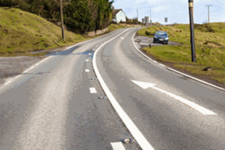

---

## No Waiting
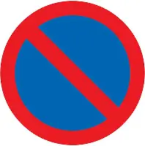

## No Stopping
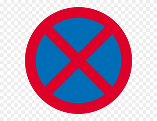

## With Flow Bus And Cycle Lane
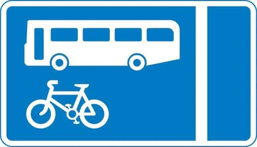

## Contraflow Bus Lane
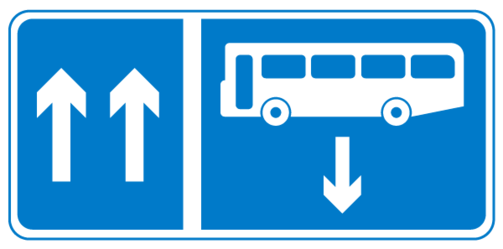

## Water coming up ahead

## Carry On And Leave The Mortorway At The Next Exit
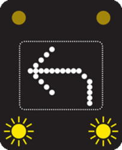

## Diversion
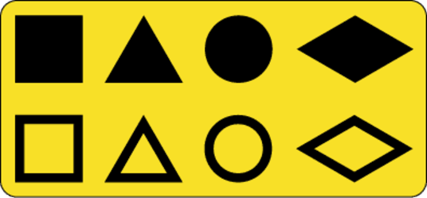

## Temporary Maximum Speed
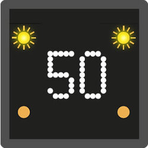

## National Speed Limit
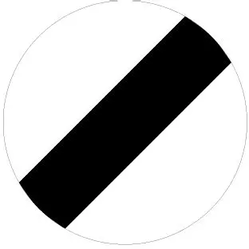

## Park And Ride Car Park
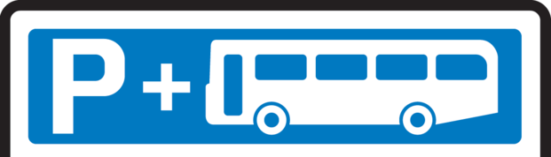

## Motorway Starts
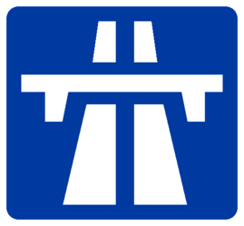

## Motorway Stops
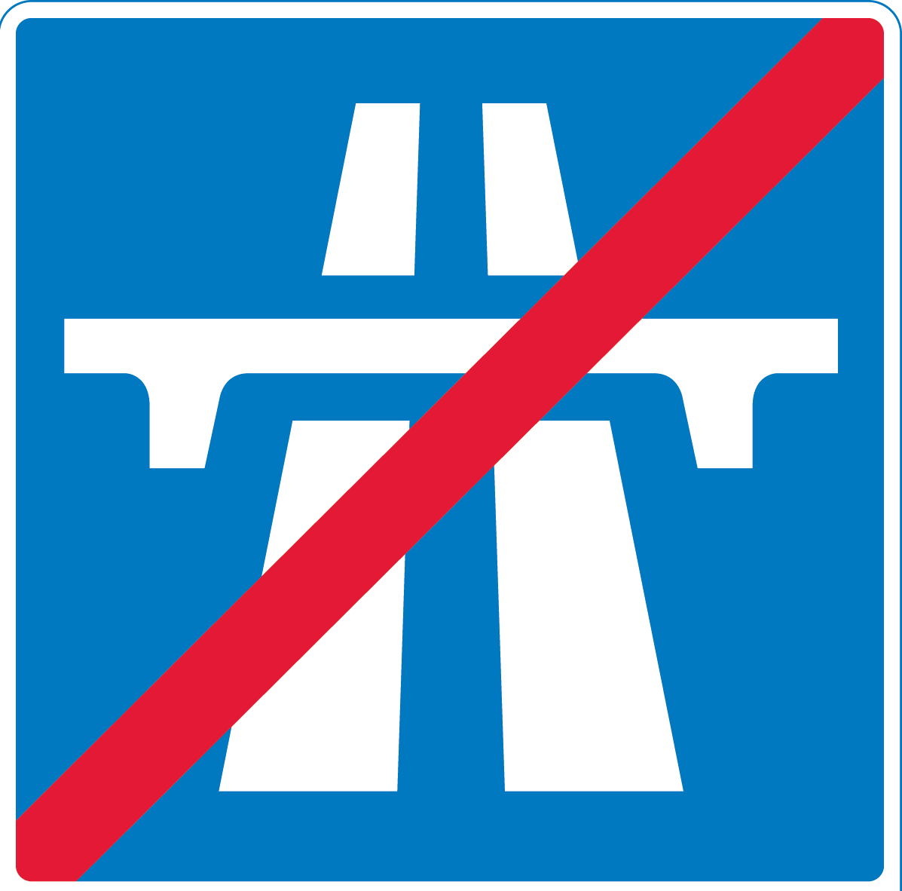

## Crawler Lane For Heavy And Slow Viechles
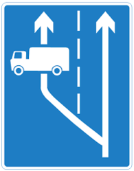

## Level Crossing With Gate Or Barrier
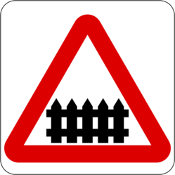

## Viechles May Park Fully On The Verge Or Fotway
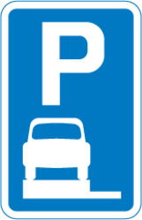

## No Motor Viechles
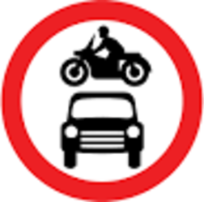

## No Overtaking
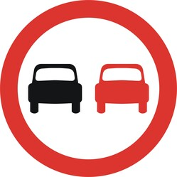

## Road Narrows On Both Sides
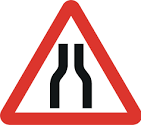

## End Of Dual Carrigeway
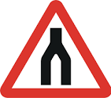

## Hump Bridge
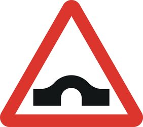

## Humps For Number Of Miles
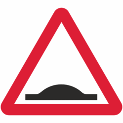

## Roundabout
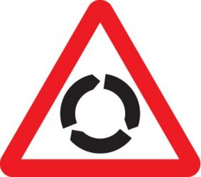

## Mini Roundabout
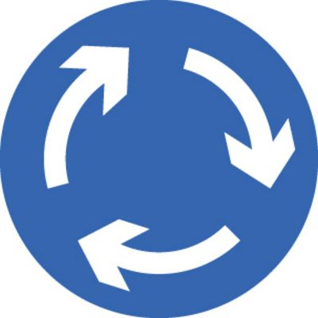

## Slippery Roads
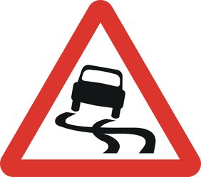

## Side Winds
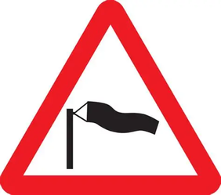

## Qeues Likely
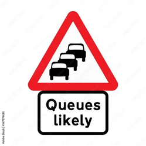

## Low Flying Aircraft

## Variable Message Sign
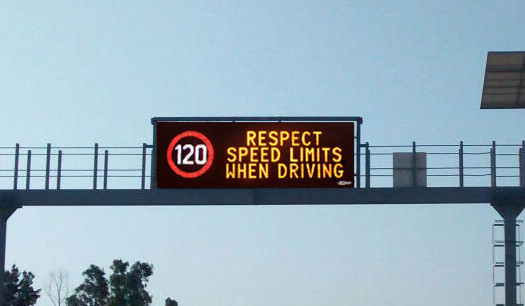

# Questions About Arm Signals

## Turn Left Arm Signal
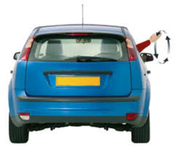

## Turn Right Arm Signal
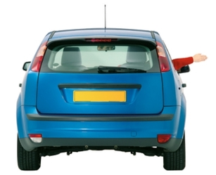

## Slow Down Or Stop Arm Signal
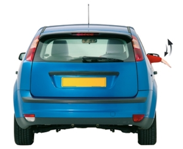
